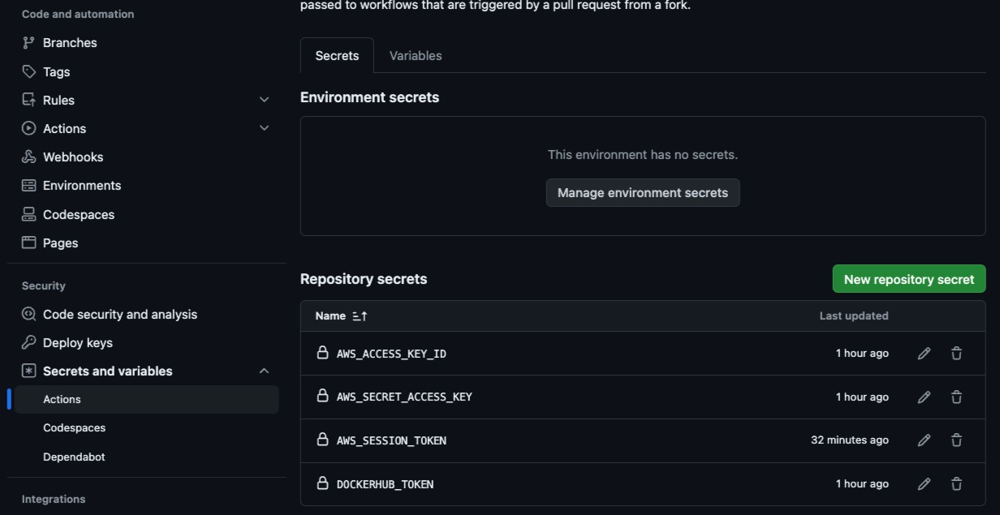

# Kubernetes with CI/CD and GitHub Actions


This project is a comprehensive guide to implementing CI/CD pipelines for Kubernetes using GitHub Actions.

It covers everything from setting up a Kubernetes cluster to automating the deployment process with GitHub Actions.

Whether you're new to Kubernetes or looking to enhance your existing CI/CD workflows, this guide provides step-by-step instructions and best practices to streamline your development process.

With the power of GitHub Actions, you can easily automate the building, testing, and deployment of your Kubernetes applications, ensuring faster and more reliable releases.

Get started today and take your CI/CD to the next level with Kubernetes and GitHub Actions.

## Disambiguation

**CI (Continuous Integration)** is the practice of automating the integration of code changes from multiple contributors into a project.

**CD (Continuous Delivery)** is the practice of automating the delivery of changed code to production environments, ensuring that the software is always deployable.

## Steps

### On your cloned version of this repository

Change the data:

- Cluster name;
- Docker username;
- Docker image name;

In [.github/workflows/cd.yml](.github/workflows/cd.yml)

Change the data:

- Image name;

In [k8s/node-deployment.yaml](k8s/node-deployment.yaml)

### On Amazon

- Create a cluster, eg.:
  - 
- Create a node linked to this cluster, eg.:
  - 
- Get the data from:
  - `AWS_ACCESS_KEY_ID`;
  - `AWS_SECRET_ACCESS_KEY`;
  - `AWS_SESSION_TOKEN`
    - Within default account: [https://stackoverflow.com/a/37947853/3929980](https://stackoverflow.com/a/37947853/3929980)
    - Within AWS Academy:
      - `AWS Details` > `AWS CLI` > `Show`

### On Google

#### Locally

1. Ensure:

  - you have `gcloud` installed: [https://cloud.google.com/sdk/docs/install](https://cloud.google.com/sdk/docs/install) or [https://cloud.google.com/sdk/docs/downloads-interactive](https://cloud.google.com/sdk/docs/downloads-interactive)
  - you are logged in: `gcloud auth login`
  - you are in a project: `gcloud config set project <PROJECT_ID>` eg.: `gcloud config set project thermal-micron-427901-e1`

2. Create a GKE Cluster:

```bash
gcloud container clusters create $GKE_CLUSTER \
	--project=$GKE_PROJECT \
	--zone=$GKE_ZONE
```

eg.:

```bash
export GKE_CLUSTER=my-cluster; export GKE_PROJECT=thermal-micron-427901-e1; export GKE_ZONE=us-east1; gcloud container clusters create $GKE_CLUSTER --project=$GKE_PROJECT --zone=$GKE_ZONE --disk-type pd-standard --num-nodes=1 --machine-type=e2-micro --node-locations=us-east1-b
```

* `--num-nodes` reduce the number of nodes;  `---machine-type` define cpu resources;
* `--node-locations` define number of available zones;
* `--disk-type pd-standard` prevents the error about quota)

3. Follow [https://docs.github.com/en/actions/use-cases-and-examples/deploying/deploying-to-google-kubernetes-engine](https://docs.github.com/en/actions/use-cases-and-examples/deploying/deploying-to-google-kubernetes-engine) until before `Creating the workflow` topic.

## On Docker Hub

- Create a Personal Access Token - [https://app.docker.com/settings/personal-access-tokens/create](https://app.docker.com/settings/personal-access-tokens/create)

## On GitHub

With the cloned version of this repository, go to your repository and Settings:

- `Security` > `Actions`;
- Go to `Secrets` tab, `New repository secret`:
  - 
  - Add the following tokens with the previous captured values:
    - `AWS_ACCESS_KEY_ID`;
    - `AWS_SECRET_ACCESS_KEY`;
    - `AWS_SESSION_TOKEN`;
    - `DOCKERHUB_TOKEN`.

## When developing

When a commit is made, if everything is correct, we see the images:

- Commit checks:
  - 
- CI
  - 
- CD:
  - 

### Tips

### Building the image locally

```bash
docker build . -t carlohcs/kubernetes-ci-cd-github-actions
```

### Running the application locally (after image build)

```bash
docker run -p 3000:3000 carlohcs/kubernetes-ci-cd-github-actions
```

### GKE - Best zone

[https://googlecloudplatform.github.io/region-picker/](https://googlecloudplatform.github.io/region-picker/)

---
Enjoy!
